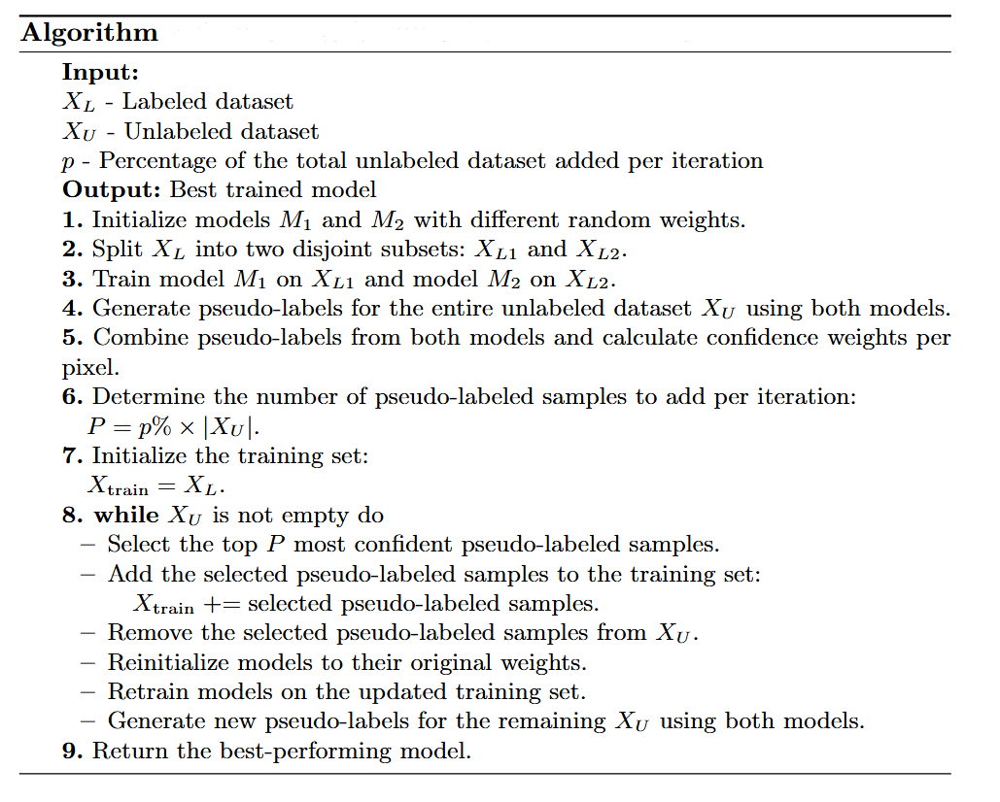

# Mutual-Training Pseudo-Labeling Framework for Fire Segmentation

This repository contains code and experiments related to the paper:

**"Iterative Mutual Pseudo-Labeling for Fire Segmentation"**

## Abstract

Fires pose serious risks to human life, infrastructure, and the environment. While computer vision and deep learning have improved fire detection, a major challenge remains the need for large-scale annotated datasets. This project addresses that challenge by implementing a **semi-supervised learning (SSL)** framework based on **iterative pseudo-labeling and mutual training**.

Our method leverages a small set of labeled data and a larger pool of unlabeled images. Through repeated training and pseudo-label refinement, we demonstrate that it is possible to reach performance comparable to fully supervised models, while greatly reducing annotation effort.

Experiments were conducted on the **Corsican Fire Dataset**, with strong results in fire segmentation tasks.

## Project Structure

```
├── 📂 images/                 # Folder with images (e.g., for presentation or sample outputs)
├── 📂 src/                    # Main source code
│   ├── config.py              # Configuration file (paths, hyperparameters, etc.)
│   ├── data_setup.py          # Data preparation and splitting
│   ├── initial_training.py    # Code for initial model training
│   ├── metrics.py             # Evaluation metrics (e.g., IoU, Dice)
│   ├── model.py               # Model definition (e.g., UNet)
│   ├── pseudo_training.py     # Pseudo-labeling and further training
│   ├── train.py               # Training loop logic
│   └── utils.py               # Utility functions ()
├── requirements.txt           # Python dependencies for reproducibility
└── README.md                  # Project documentation
```

## Getting Started

# 1. Clone the repository:
```bash
git clone https://github.com/Antunovic/Semi-Supervised-Pseudo-Labeling-Framework.git
cd pseudo_labeling
```

# 2. Install dependencies:
```bash
pip install -r requirements.txt
```

# 3. Prepare the Dataset

To use this project, you need to prepare the Corsican Fire Dataset in the following way:

1. Create a directory named `data/` in the root of the project.

2. Inside the `data/` directory, place the **Corsican Fire Dataset** organized into the following structure:

```
data/
├── images/ # Input RGB images
└── masks/ # Corresponding binary segmentation masks
```

3. **Important Notes:**
- All images and masks must be resized to **512×512 pixels** while **preserving the original aspect ratio** (e.g., by padding).
- Masks should be saved in `.npy` format to ensure compatibility with the training pipeline.


# 4. Run Training

Before starting the training process, make sure to configure all relevant settings in the `src/config.py` file. This includes:

- Number of training epochs  
- Learning rate  
- Paths to data directories  
- Output directory for saving checkpoints and results  
- Any other hyperparameters specific to your experiment  

Once configured, start the training by running the following command from the root directory:

```bash
python src/train.py
```

## Proposed algorithm



## Citation

If you use this code or method, please cite the paper (once published).

## Contact

For questions or feedback, feel free to contact [antonio.antunovic@ferit.hr].

## License

This project is licensed under the [MIT License](LICENSE).
